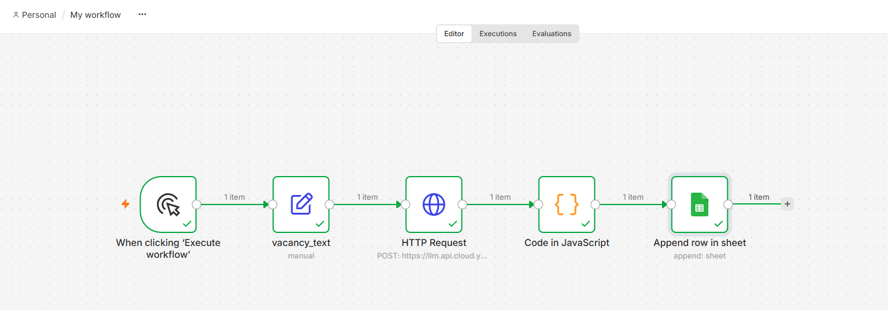
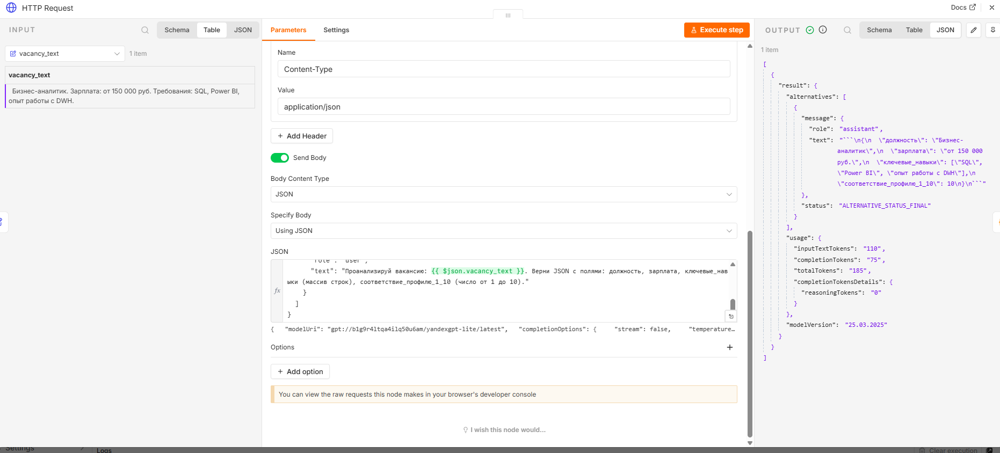
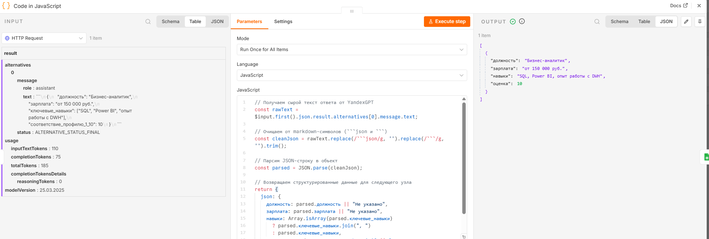
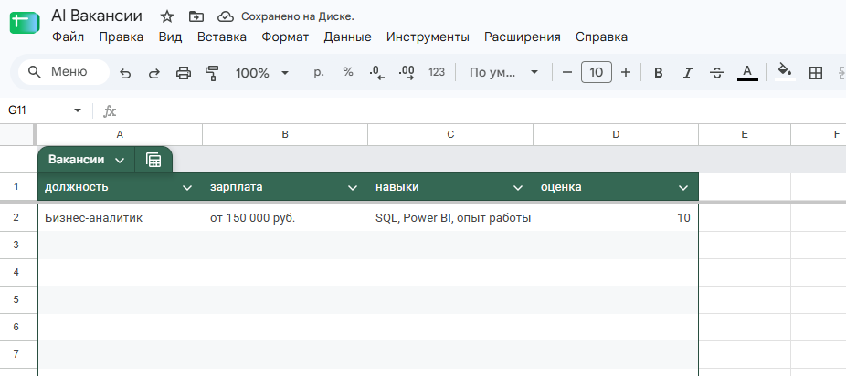

# AI-анализатор вакансий с YandexGPT

**Дата:** Сентябрь 2026  
**Автор:** Kris-Tsilik  
**Статус:** Завершён

---

## Описание проекта

Автоматизированный воркфлоу для анализа вакансий с использованием AI. Система принимает текст вакансии, отправляет его в YandexGPT API для структурированного анализа и автоматически записывает результаты в Google Таблицу.

## Цель проекта

- Изучить принципы построения AI-воркфлоу
- Освоить интеграцию с API (YandexGPT)
- Научиться обрабатывать и структурировать данные от AI
- Создать практический инструмент для анализа рынка труда

## Использованные технологии

- **n8n.cloud** — оркестратор воркфлоу
- **YandexGPT API** — AI-модель для анализа текста
- **Google Sheets API** — хранение результатов
- **JavaScript** — обработка данных в Code node
- **REST API** — HTTP-запросы к внешним сервисам

## Архитектура решения

Manual Trigger → Edit Fields → HTTP Request → Code → Google Sheets  
(Запуск)       → (Текст)      → (YandexGPT)   → (Парсинг) → (Запись)

### Узлы воркфлоу:

1. **Manual Trigger** — ручной запуск воркфлоу
2. **Edit Fields** — хранение текста вакансии в переменной `vacancy_text`
3. **HTTP Request** — POST-запрос к YandexGPT API с промптом
4. **Code (JavaScript)** — очистка ответа от markdown и парсинг JSON
5. **Google Sheets** — добавление строки с результатами

## Технические детали

### API YandexGPT

- **Endpoint:** `https://llm.api.cloud.yandex.net/foundationModels/v1/completion`
- **Модель:** `yandexgpt-lite`
- **Аутентификация:** API-ключ через заголовок `Authorization`

### Промпт для AI

Ты аналитик вакансий. Отвечай строго в формате JSON без markdown-разметки.
Проанализируй вакансию: {{vacancy_text}}.
Верни JSON с полями: должность, зарплата, ключевые_навыки (массив), соответствие_профилю_1_10 (число).

### JavaScript код для обработки ответа

// Получаем сырой текст ответа от YandexGPT
const rawText = $input.first().json.result.alternatives[0].message.text;

// Очищаем от markdown-символов
const cleanJson = rawText.replace(/```json/g, '').replace(/```/g, '').trim();

// Парсим JSON-строку в объект
const parsed = JSON.parse(cleanJson);

// Возвращаем структурированные данные
return {
  json: {
    должность: parsed.должность || "Не указано",
    зарплата: parsed.зарплата || "Не указано",
    навыки: Array.isArray(parsed.ключевые_навыки) 
      ? parsed.ключевые_навыки.join(", ") 
      : parsed.ключевые_навыки,
    оценка: parsed.соответствие_профилю_1_10 || 0
  }
};

## Результаты

### Входные данные

Бизнес-аналитик. Зарплата: от 150 000 руб. Требования: SQL, Power BI, опыт работы с DWH.

### Результат анализа (JSON от YandexGPT)

{
  "должность": "Бизнес-аналитик",
  "зарплата": "от 150 000 руб.",
  "ключевые_навыки": ["SQL", "Power BI", "опыт работы с DWH"],
  "соответствие_профилю_1_10": 10
}

### Запись в Google Таблицу

| Должность | Зарплата | Навыки | Оценка |
|-----------|----------|--------|--------|
| Бизнес-аналитик | от 150 000 руб. | SQL, Power BI, опыт работы с DWH | 10 |

## Чему научился

1. **Работа с API** — настройка HTTP-запросов, аутентификация через заголовки
2. **Интеграция AI** — использование YandexGPT для структурированного анализа текста
3. **Обработка данных** — парсинг JSON, очистка от markdown-символов
4. **Оркестрация** — построение многошаговых воркфлоу в n8n
5. **Автоматизация** — связь разрозненных сервисов в единый процесс

## Ссылки

- [n8n.cloud](https://n8n.cloud)
- [YandexGPT API документация](https://yandex.cloud/ru/docs/foundation-models/)
- [Google Sheets API](https://developers.google.com/sheets/api)

## Возможные улучшения

- Добавить триггер из Telegram-бота для мобильного ввода вакансий
- Интегрировать парсинг вакансий с hh.ru API
- Добавить визуализацию данных через Google Data Studio
- Расширить анализ: сравнение с рыночными зарплатами, тренды навыков

## Скриншоты

### Общий вид воркфлоу


### Настройка HTTP Request


### Код в Code node


### Результат в Google Таблице
